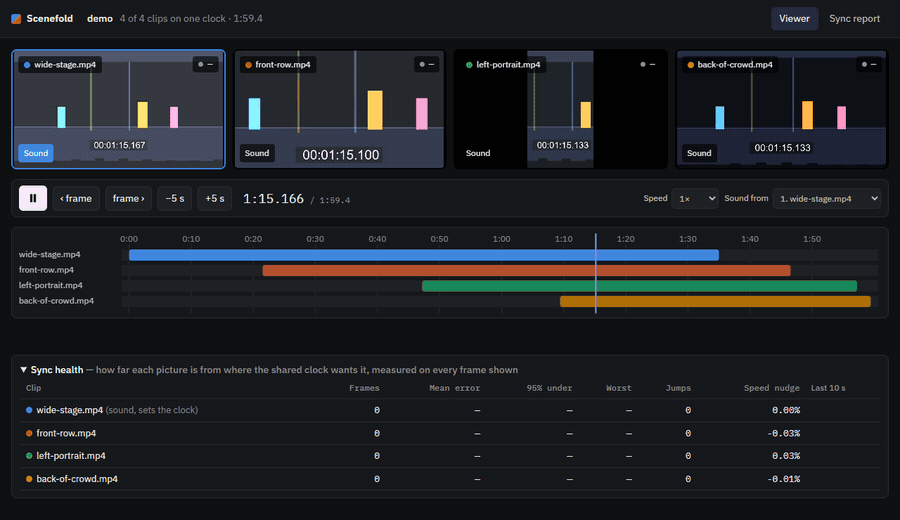

<p align="center">
  
</p>

# Scenefold

**Many people film the same moment. Scenefold folds their videos into one synced, understandable,
and trustworthy picture of what happened.**

[](https://github.com/karthi-ai-engineer/SceneFold/actions/workflows/ci.yml)
[](LICENSE)

## Status

Early development. **Ingest, sync, a synced multi-angle viewer, and a first automatic cut work
today.** Later phases add a cited story of the event, where the cameras disagree, and an edit that
knows what it is looking at. See the [roadmap](docs/ROADMAP.md) and the
[project brief](docs/PROJECT_BRIEF.md).



Four clips that started at different times, each with its own framing and its own clock, played
together on one timeline. The clock burnt into the picture is the same in every tile, and each clip
stays within a frame of where the shared clock wants it. Nobody is filmed: the clips are drawn by
`tools/demo_event.py`, so you can make this event yourself in a minute.

## What ingest does

`scenefold ingest <event> <videos or folders>` prepares phone videos of one event for the later stages:

- Keeps an untouched, read-only copy of every original.
- Makes a working copy of each video: 720p, a steady 30 fps, upright, HDR converted to normal colors,
  plus a mono 48 kHz WAV of its sound. Picture and sound start at exactly the same instant and stay
  together, even on phones whose sound clock disagrees with the file's timestamps.
- Records each clip in `manifest.json` as `ok`, `warning` (for example no audio, very short, or a
  cut-off file) or `failed`, always with the reason.
- Skips files that are not videos and videos it has already processed. One bad file never stops the rest.

```
data/<event>/
├─ originals/      your videos, untouched and read-only
├─ proxies/        working copies (<clip>.mp4) and their sound (<clip>.wav)
├─ manifest.json   what each clip is, where its files are, and any problems
├─ timeline.json   where each clip sits on the shared clock          (sync)
├─ observations/   what each clip shows, one file per clip           (observe)
└─ cut.json, cut.mp4   the shot list, with a reason each, and the film  (cut)
```

## What sync does

`scenefold sync <event>` puts the event's clips on one master timeline by comparing their sound. No
speech recognition is involved: music, claps, cheering, and background talk all help.

- Compares every pair of clips that have sound, and scores how clearly each match beats the next-best one.
- Measures and cancels clock drift: phone audio clocks run a few to a few hundred parts per million
  fast or slow, which adds up to tens of milliseconds over a few minutes.
- Solves all pairs together and drops pairs that disagree with the rest, so one bad match can't
  move the other clips. Clips that never overlap are placed through the clips between them.
- Matches the placed clips again by their pictures, which says how far each phone stood from the
  sound (below). Skip it with `--sound-only`; it is the slow part, because it reads every picture.
- Writes `timeline.json` with each clip's offset, drift, confidence and distance, every pair
  measurement, and the reason for any clip it could not place. A clip is never forced onto the
  timeline.

**Measured accuracy.** On real phone clips of a live event from the
[Jiku dataset](https://traces.cs.umass.edu/docs/traces/multimedia/), sync agrees with its published
ground truth within 6.4 ms when the clips overlap for about three minutes, and within 26 ms for
80-second overlaps, for five of six phones. The sixth (a Nexus S) differs by 70–110 ms; which side is
right is not settled yet. On the same clips it matched
[audio-offset-finder](https://github.com/bbc/audio-offset-finder) and
[audalign](https://github.com/benfmiller/audalign) over 80 seconds and beat both over three minutes,
where their lack of clock-drift handling shows (`tools/baselines.py`).

**Sound takes time to arrive, so the pictures are matched too.** Sound travels about one metre
every 2.9 ms, so a phone further from the speakers hears everything late — and sync, which listens,
ends up putting its picture ahead of everybody else's by exactly that much: its flash comes first
on the shared clock. At a stadium concert the phones were up to 423 ms apart in when they heard the
music, twelve frames of visible mismatch. So the placed clips are matched a second time by how
their brightness changes (stage lighting, flashes), which gives each clip a `heard_late_s`: how
much later than the nearest clip that phone heard the event.

- `scenefold sync` reports it as a distance, and the viewer can line up the pictures instead of the
  sound — what you want when watching several angles at once.
- It needs light that changes together. Where the lighting is steady it says it cannot tell instead
  of guessing: a match is believed only when it stands clear of matches at unrelated times *and*
  leads every other moment it could have matched, since anything that repeats — stage lighting on
  a beat, or the mark video encoding leaves on every keyframe — matches at every repeat.
- Accuracy: on drawn clips where the true answer is zero it reads within 17 ms, half a frame.

**Different nights, same song.** Bands play along to backing tracks that are identical every night,
so clips of the same song from two shows can match on the music alone. Sync checks that a match
holds all through the overlap (the singing, talk, and crowd must line up too) and sets aside pairs
that match only in parts, so clips from another night are reported instead of placed. Only the
largest group is placed for now.

**Known limits.** Sound that repeats exactly, like the same recorded song played twice, can match
the wrong place when only two clips share it. A phone that moves while filming shifts its sound by
about 3 ms per metre, and one distance per clip cannot follow it. Edited uploads (with cuts) can't
be placed as one clip. Clips without usable sound can't be placed yet.

`scenefold evaluate <event> <truth.json>` measures sync error against ground truth: moments such as
claps, with their time in each clip that caught them.

## What fusing does

`scenefold fuse <event>` is where the clips stop being separate. Every clip's timed moments go onto
the shared clock, and the ones that land together are taken to be the same thing happening:

```
Event coldplay-jan26: 311 moments on the shared clock, 118 of them caught by more than one clip
Where the clips disagree: 69 (62 left unresolved, which is the honest answer when no camera had a
clearly better view)
    198.51 s  both  seen by 5 clips
      A large outdoor concert at night features a brightly lit stage with dynamic lighting effects
```

- **Corroboration is the point.** Five phones catching one instant is far stronger evidence than
  one phone describing it. On clips that all film the same thing, 219 of 298 moments were caught by
  more than one camera; on real concert footage, where phones point different ways, 118 of 311.
- **Disagreements are found, not smoothed over.** When two clips agree something happened and a
  third with as good a view caught nothing, that is recorded with its type and either a resolution
  or an honest "unresolved".
- **Resolved by the better view, never by majority.** Three phones behind a pillar do not outvote
  the one with a clear line of sight. When the camera with the best view is the one that missed it,
  that stays unresolved — it is exactly the case where the thing may not have happened at all.
- **The accounts are read against each other**, which arithmetic cannot do: the model on your
  computer is shown two descriptions of one moment and asked whether both could be true at that
  instant. Differences of wording, detail or focus are not disagreements; a dark empty stage
  against a lit one with a band on it is. The same pair of sentences is only read once however
  many moments they cover, so a five-minute event costs about fifty readings, not three hundred.
  Skip it with `--no-reading`.
- Everything lands in `knowledge.sqlite`, which a later phase can ask questions of, and every claim
  carries the clip it came from.

## What the story does

`scenefold story <event>` writes a short account of what happened, from the event store and
nothing else:

```
  0:33.9  A large concert at night, the audience holding up glowing lights, the stage shifting
          from bright white beams to warm yellow-green.
          from f098e4bb
  2:48.2  A performer stands on a circular stage while the audience holds up red lights.
          (the clips disagree here)
          from 34b92d86, f098e4bb
```

Every sentence ends up pointing at a moment, and the citations are checked **in code, not by the
model**: the moment has to exist in the store, and a clip that saw it has to have been filming at
that time. A sentence that fails is removed and the reason kept in `story.json`, so a reader sees
only what the footage supports and anyone auditing can see what was thrown away.

That is the difference between a story about an event and a story that merely sounds like one: not
that the model behaves, but that nothing reaches a reader without footage behind it. On the concert
it kept 15 sentences, dropped none, and marked 4 as moments the clips disagreed about.

**What this cannot check**: whether a sentence that cites a real moment describes it truthfully. A
model can cite correctly and still embroider. That needs a person watching footage they know.

## What the cut does

`scenefold cut <event>` edits the angles into one film, with no AI and no idea of what is being
filmed. It judges each second of each clip on three things a camera can be wrong about — how much
detail the picture holds, how far the whole frame shifts (a phone being waved about, or a fast pan)
and how much is crushed black or blown white — and scores them against the other angles of the same
event.

Those scores are weighed against three rules an editor would recognise: hold a shot for at least a
few seconds, don't cut unless the new angle is clearly better, and don't bounce straight back to
the angle you just left. Every way the film could be built is weighed at once, so the result is the
best *sequence of shots*, not the best angle second by second.

- The sound comes from one microphone and runs unbroken: the longest clip, and of equally long
  ones the nearest to the stage, because its sound is the least delayed. The film lasts exactly as
  long as that clip was recording.
- Pictures are lined up on the event, not on when each phone heard it, so a cut never jumps in time.
- `cut.json` records every shot with the reason it was chosen ("steadiest picture of the angles
  recording", "the only angle recording", "kept rolling: cutting away would have cost more than it
  gained"), and `cut.mp4` is the film. `--plan-only` writes the shot list without rendering.

**Known limits.** Footage outside the microphone clip's span isn't used — the price of never
cutting the sound. The cut doesn't yet use what is *in* the picture, so a sharp shot of the floor
beats a shaky shot of the moment everyone came for; that arrives when the observations below feed
the cut.

## What observing does

`scenefold observe <event>` asks a model what each clip shows, a few seconds at a time, and writes
it to `observations/<clip_id>.json` — times in that clip's own seconds, so re-running sync never
invalidates them.

- **It runs on your computer.** The default is `qwen3.5:4b` through [Ollama](https://ollama.com):
  about 3 seconds per window on a laptop GPU, no cost, and no footage leaves the machine. That
  matters, because most footage is of people who agreed to be filmed by a friend, not to be
  uploaded to anyone's API. Any other model is one small class (`observe.Watcher`).
- **Each clip is watched alone**, so two angles of one moment stay two independent witnesses. A
  disagreement between them only means something if neither account was written with the other in
  view.
- **Nothing is taken as true.** Each observation is kept with a reason to doubt it: how good the
  picture was over that window, which model said it, and when. Small models are confident about
  everything, so their self-rated confidence is not recorded — the picture score is.
- Running it again costs nothing: clips already watched with the same model and the same question
  are left alone (`--again` overrides).

It also **listens**, if you install the speech extra. Whisper writes down what was said with a time
for every word, which is what later phases need to find the moment somebody said something.

- Whisper fills silence with whatever it expects to hear, so speech is only kept where a voice was
  actually detected. On twenty minutes of concert footage it kept one short line — the music did
  not become pages of invented lyrics. On a spoken test clip it caught every word, each timed.
- It uses your graphics card if NVIDIA's maths libraries are installed, and the processor if not:
  a missing library makes the run slower, never failed.
- Watching and listening are cached apart, so adding speech later doesn't re-watch the pictures.

It also finds the **moments** in each clip by arithmetic alone — when the sound suddenly grows (a
clap, a hit, a cheer starting) and when the picture suddenly changes (a flash, a light cue). A
model watching ten seconds can say *what* happened but not *when* inside them; an onset can be
placed to a few hundredths of a second without understanding anything. So each description is
pulled onto the moment that stands out most inside its window, and each spoken line onto the sound
that starts it. On the concert clips, 77 of 91 windows ended up with an exact time; a window
described as "bright blue lights and a crane structure" now points at 18.34 s rather than
"somewhere in 12–24 s". Where nothing stands out, the coarse time is kept rather than invented.

```sh
uv run scenefold observe my-event            # needs `ollama pull qwen3.5:4b` once
uv sync --extra speech                       # once, if you want speech as well
uv run scenefold observe my-event --speech-model small
```

## Requirements

- [uv](https://docs.astral.sh/uv/), which also installs Python 3.13 for the project.
- [FFmpeg](https://ffmpeg.org/) with `ffprobe`, on your PATH. Version 7 or newer is recommended;
  Scenefold is developed and tested with FFmpeg 9.0. The test suite needs at least FFmpeg 6.0.
  Converting HDR videos needs the `zscale` filter (FFmpeg built with libzimg).

## Install

**Windows**

```powershell
winget install --id=astral-sh.uv -e
winget install --id=Gyan.FFmpeg -e
```

**macOS**

```sh
brew install uv ffmpeg-full
echo 'export PATH="$(brew --prefix ffmpeg-full)/bin:$PATH"' >> ~/.zshrc
```

Homebrew's smaller `ffmpeg` formula also works, but it has no `zscale`, so HDR videos keep
washed-out colors and ingest marks them with a warning.

**Linux (Debian, Ubuntu)**

```sh
curl -LsSf https://astral.sh/uv/install.sh | sh
sudo apt install ffmpeg
```

Ubuntu 24.04 ships FFmpeg 6.1, which is older than the version Scenefold is tested with.

Open a new terminal, check that `uv --version` and `ffmpeg -version` both work, then get the code:

```sh
git clone https://github.com/karthi-ai-engineer/SceneFold.git
cd SceneFold
uv sync
```

## Quick start

```sh
uv run scenefold ingest my-event path/to/videos
```

```
[1/2] IMG_4821.MOV ... added: ok (clip cd0df451e898, 10.0 s, 720x1280)
[2/2] VID_20260917_153012.mp4 ... added: ok (clip 9605c47daf16, 30.0 s, 1280x720)

Summary: 2 added
Manifest: data/my-event/manifest.json
```

Run the same command again and finished clips show `unchanged`. Event names use letters, digits,
`-` and `_`. Use `--data-dir` to keep events somewhere other than `./data`.

No videos to hand? `uv run python tools/demo_event.py` draws the imaginary show from the picture
above — four clips that start at different times, frame different parts of it, and run on their own
clocks — then ingests and syncs them, ready for `uv run scenefold view demo`.

```sh
uv run scenefold sync my-event
```

```
Event my-event: 2 of 2 clips on one clock (master timeline 30.0 s)
  VID_20260917_153012.mp4      +0.000 s    30.0 s  confidence 12.4
  IMG_4821.MOV                +18.480 s    10.0 s  confidence 12.4
Pairs: 1 measured, 1 used
Timeline: data/my-event/timeline.json
```

A clip's offset is where its first frame sits on the shared clock. When two clips overlap for about
30 seconds or more, each line also shows the clip's clock drift.

### Checking sync with claps

Film a few sharp claps that every phone hears, near the start and the end. Find each clap's time in
every clip, for example by stepping frame by frame through the working copies in
`data/<event>/proxies/`, and write them down:

```json
{"moments": [
  {"label": "first clap", "times": {"VID_20260917_153012.mp4": 19.100, "IMG_4821.MOV": 0.620}},
  {"label": "last clap",  "times": {"VID_20260917_153012.mp4": 28.233, "IMG_4821.MOV": 9.753}}
]}
```

```sh
uv run scenefold evaluate my-event claps.json
```

Clips are named by file name, or by clip ID when two files share a name.

### Making the film

```sh
uv run scenefold cut my-event
```

```
Film of my-event: 13 shots, 5:08.0 long, sound from Dharm.mp4 (recorded longest, so its sound
covers the most of the event)
    0.0-  59.0 s  Dharm.mp4    the only angle recording
   59.0-  88.0 s  Somnath.mp4  best exposed of the angles recording
   88.0-  95.0 s  Dharm.mp4    sharpest picture of the angles recording
   ...
Shots: data/my-event/cut.json
Film: data/my-event/cut.mp4
```

### Watching the clips together

```sh
uv run scenefold view my-event
```

This opens the viewer in your browser (served from your own computer only, `http://127.0.0.1:8765`).
Every placed clip plays at once, lined up on the shared clock; clips that weren't recording at that
moment say when they start or that they stopped.

- **Space** plays or pauses; **←/→** jump 5 seconds; **, and .** step one frame; **1–9** pick whose
  sound you hear. Click or drag the lanes under the videos to jump anywhere. 0.25× and 0.5× help
  when checking a clap frame by frame.
- **Line up** chooses what the shared clock holds together: the **pictures** (what you want when
  watching several angles, since a distant phone heard the event late) or the **sound heard**.
- **Sync health** shows, for every frame each video shows, how far it is from where the clock wants
  it. On real phone clips it stays within half a frame; one frame at 30 fps is 33 ms.
- **Sync report** shows which clips were placed, how far each phone stood from the sound, every
  pair measurement, and why any was set aside.

The clock follows the clip you are listening to, so its sound is never sped up or slowed down; the
other videos are nudged a little faster or slower to stay with it.

## Development

```sh
uv run pytest                      # all tests; they generate small test videos with FFmpeg
uv run ruff format src tests tools
uv run ruff check src tests tools
node --test web/tests/sync.test.mjs                               # the viewer's timing rules
uv run --with playwright python tools/check_viewer.py my-event   # viewer sync, in headless Chrome
uv run python tools/demo_event.py                                # an imaginary event, nobody filmed
uv run --with playwright python tools/record_viewer.py demo      # the GIF above
```

The maintainer's clones use a commit guard that only accepts the maintainer's GitHub identity:

```sh
git config user.name "Karthi AI Engineer"
git config user.email "296384397+karthi-ai-engineer@users.noreply.github.com"
git config core.hooksPath .githooks
```

## Project layout

```
src/scenefold/   pipeline code: cli, ingest, media (FFmpeg), manifest and timeline (data formats),
                 audio_offset and picture_offset (matching clips by sound and by light), sync,
                 evaluate (sync error), quality and cut (the film), observe and observations
                 (what each clip shows), view (server)
tests/           tests
tools/           developer scripts, e.g. fetching a public dataset to measure sync on real footage
web/             the viewer: plain HTML, CSS and JavaScript modules, no build step
docs/            project brief and roadmap
data/            your events; never committed
```

## Responsible use

- Only use footage from people who agreed to be filmed.
- Scenefold never modifies your original files; it works on copies.
- Working copies have location and device metadata removed.
- Everything runs on your own machine; nothing is uploaded. Later phases may use cloud AI services;
  the plan is to make that a clear choice and to offer face blurring first.

## License

Copyright 2026 Karthi AI Engineer. Licensed under the [Apache License 2.0](LICENSE).
