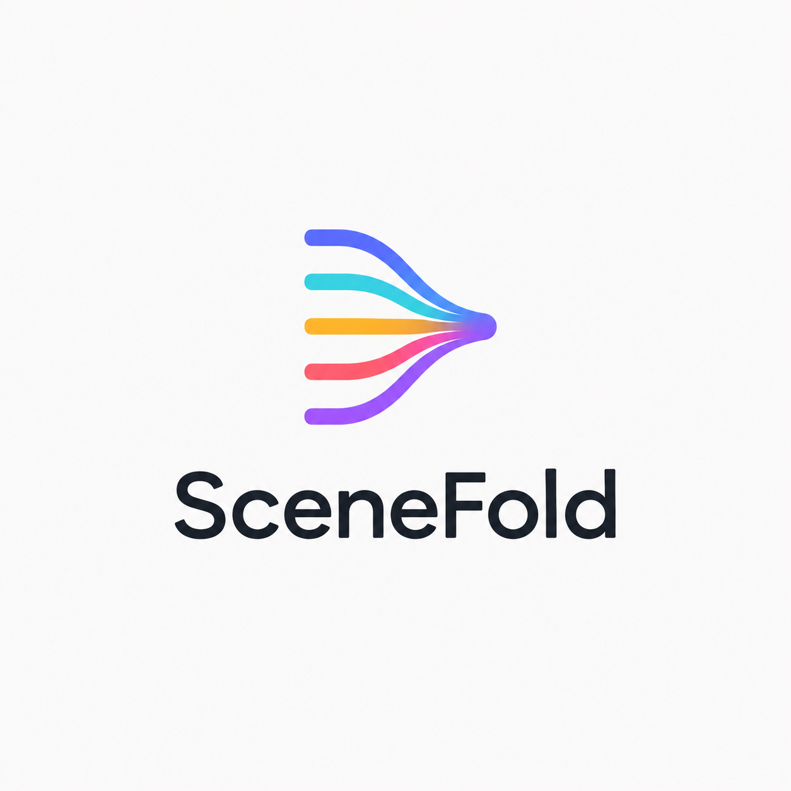

<p align="center">
  
</p>

# Scenefold

**Many people film the same moment. Scenefold folds their videos into one synced, understandable,
and trustworthy picture of what happened.**

[](https://github.com/karthi-ai-engineer/SceneFold/actions/workflows/ci.yml)
[](LICENSE)

## Status

Early development. **Ingest, sync, and a synced multi-angle viewer work today.** Later phases add a
cited story of the event, where the cameras disagree, and an automatic edit. See the
[roadmap](docs/ROADMAP.md) and the [project brief](docs/PROJECT_BRIEF.md).

## What ingest does

`scenefold ingest <event> <videos or folders>` prepares phone videos of one event for the later stages:

- Keeps an untouched, read-only copy of every original.
- Makes a working copy of each video: 720p, a steady 30 fps, upright, HDR converted to normal colors,
  plus a mono 48 kHz WAV of its sound. Picture and sound start at exactly the same instant and stay
  together, even on phones whose sound clock disagrees with the file's timestamps.
- Records each clip in `manifest.json` as `ok`, `warning` (for example no audio, very short, or a
  cut-off file) or `failed`, always with the reason.
- Skips files that are not videos and videos it has already processed. One bad file never stops the rest.

```
data/<event>/
├─ originals/      your videos, untouched and read-only
├─ proxies/        working copies (<clip>.mp4) and their sound (<clip>.wav)
└─ manifest.json   what each clip is, where its files are, and any problems
```

## What sync does

`scenefold sync <event>` puts the event's clips on one master timeline by comparing their sound. No
speech recognition is involved: music, claps, cheering, and background talk all help.

- Compares every pair of clips that have sound, and scores how clearly each match beats the next-best one.
- Measures and cancels clock drift: phone audio clocks run a few to a few hundred parts per million
  fast or slow, which adds up to tens of milliseconds over a few minutes.
- Solves all pairs together and drops pairs that disagree with the rest, so one bad match can't
  move the other clips. Clips that never overlap are placed through the clips between them.
- Writes `timeline.json` with each clip's offset, drift, and confidence, every pair measurement, and
  the reason for any clip it could not place. A clip is never forced onto the timeline.

**Measured accuracy.** On real phone clips of a live event from the
[Jiku dataset](https://traces.cs.umass.edu/docs/traces/multimedia/), sync agrees with its published
ground truth within 6.4 ms when the clips overlap for about three minutes, and within 26 ms for
80-second overlaps, for five of six phones. The sixth (a Nexus S) differs by 70–110 ms; which side is
right is not settled yet. On the same clips it matched
[audio-offset-finder](https://github.com/bbc/audio-offset-finder) and
[audalign](https://github.com/benfmiller/audalign) over 80 seconds and beat both over three minutes,
where their lack of clock-drift handling shows (`tools/baselines.py`).

**Different nights, same song.** Bands play along to backing tracks that are identical every night,
so clips of the same song from two shows can match on the music alone. Sync checks that a match
holds all through the overlap (the singing, talk, and crowd must line up too) and sets aside pairs
that match only in parts, so clips from another night are reported instead of placed. Only the
largest group is placed for now.

**Known limits.** Sound that repeats exactly, like the same recorded song played twice, can match
the wrong place when only two clips share it. A phone that moves while filming shifts its sound by
about 3 ms per metre. Edited uploads (with cuts) can't be placed as one clip. Clips without usable
sound can't be placed yet.

`scenefold evaluate <event> <truth.json>` measures sync error against ground truth: moments such as
claps, with their time in each clip that caught them.

## Requirements

- [uv](https://docs.astral.sh/uv/), which also installs Python 3.13 for the project.
- [FFmpeg](https://ffmpeg.org/) with `ffprobe`, on your PATH. Version 7 or newer is recommended;
  Scenefold is developed and tested with FFmpeg 9.0. The test suite needs at least FFmpeg 6.0.
  Converting HDR videos needs the `zscale` filter (FFmpeg built with libzimg).

## Install

**Windows**

```powershell
winget install --id=astral-sh.uv -e
winget install --id=Gyan.FFmpeg -e
```

**macOS**

```sh
brew install uv ffmpeg-full
echo 'export PATH="$(brew --prefix ffmpeg-full)/bin:$PATH"' >> ~/.zshrc
```

Homebrew's smaller `ffmpeg` formula also works, but it has no `zscale`, so HDR videos keep
washed-out colors and ingest marks them with a warning.

**Linux (Debian, Ubuntu)**

```sh
curl -LsSf https://astral.sh/uv/install.sh | sh
sudo apt install ffmpeg
```

Ubuntu 24.04 ships FFmpeg 6.1, which is older than the version Scenefold is tested with.

Open a new terminal, check that `uv --version` and `ffmpeg -version` both work, then get the code:

```sh
git clone https://github.com/karthi-ai-engineer/SceneFold.git
cd SceneFold
uv sync
```

## Quick start

```sh
uv run scenefold ingest my-event path/to/videos
```

```
[1/2] IMG_4821.MOV ... added: ok (clip cd0df451e898, 10.0 s, 720x1280)
[2/2] VID_20260917_153012.mp4 ... added: ok (clip 9605c47daf16, 30.0 s, 1280x720)

Summary: 2 added
Manifest: data/my-event/manifest.json
```

Run the same command again and finished clips show `unchanged`. Event names use letters, digits,
`-` and `_`. Use `--data-dir` to keep events somewhere other than `./data`.

```sh
uv run scenefold sync my-event
```

```
Event my-event: 2 of 2 clips on one clock (master timeline 30.0 s)
  VID_20260917_153012.mp4      +0.000 s    30.0 s  confidence 12.4
  IMG_4821.MOV                +18.480 s    10.0 s  confidence 12.4
Pairs: 1 measured, 1 used
Timeline: data/my-event/timeline.json
```

A clip's offset is where its first frame sits on the shared clock. When two clips overlap for about
30 seconds or more, each line also shows the clip's clock drift.

### Checking sync with claps

Film a few sharp claps that every phone hears, near the start and the end. Find each clap's time in
every clip, for example by stepping frame by frame through the working copies in
`data/<event>/proxies/`, and write them down:

```json
{"moments": [
  {"label": "first clap", "times": {"VID_20260917_153012.mp4": 19.100, "IMG_4821.MOV": 0.620}},
  {"label": "last clap",  "times": {"VID_20260917_153012.mp4": 28.233, "IMG_4821.MOV": 9.753}}
]}
```

```sh
uv run scenefold evaluate my-event claps.json
```

Clips are named by file name, or by clip ID when two files share a name.

### Watching the clips together

```sh
uv run scenefold view my-event
```

This opens the viewer in your browser (served from your own computer only, `http://127.0.0.1:8765`).
Every placed clip plays at once, lined up on the shared clock; clips that weren't recording at that
moment say when they start or that they stopped.

- **Space** plays or pauses; **←/→** jump 5 seconds; **, and .** step one frame; **1–9** pick whose
  sound you hear. Click or drag the lanes under the videos to jump anywhere. 0.25× and 0.5× help
  when checking a clap frame by frame.
- **Sync health** shows, for every frame each video shows, how far it is from where the clock wants
  it. On real phone clips it stays within half a frame; one frame at 30 fps is 33 ms.
- **Sync report** shows which clips were placed, every pair measurement, and why any was set aside.

The clock follows the clip you are listening to, so its sound is never sped up or slowed down; the
other videos are nudged a little faster or slower to stay with it.

## Development

```sh
uv run pytest                      # all tests; they generate small test videos with FFmpeg
uv run ruff format src tests tools
uv run ruff check src tests tools
node --test web/tests/sync.test.mjs                               # the viewer's timing rules
uv run --with playwright python tools/check_viewer.py my-event   # viewer sync, in headless Chrome
```

The maintainer's clones use a commit guard that only accepts the maintainer's GitHub identity:

```sh
git config user.name "Karthi AI Engineer"
git config user.email "296384397+karthi-ai-engineer@users.noreply.github.com"
git config core.hooksPath .githooks
```

## Project layout

```
src/scenefold/   pipeline code: cli, ingest, media (FFmpeg), manifest and timeline (data formats),
                 audio_offset and sync (matching clips by sound), evaluate (sync error), view (server)
tests/           tests
tools/           developer scripts, e.g. fetching a public dataset to measure sync on real footage
web/             the viewer: plain HTML, CSS and JavaScript modules, no build step
docs/            project brief and roadmap
data/            your events; never committed
```

## Responsible use

- Only use footage from people who agreed to be filmed.
- Scenefold never modifies your original files; it works on copies.
- Working copies have location and device metadata removed.
- Everything runs on your own machine; nothing is uploaded. Later phases may use cloud AI services;
  the plan is to make that a clear choice and to offer face blurring first.

## License

Copyright 2026 Karthi AI Engineer. Licensed under the [Apache License 2.0](LICENSE).
